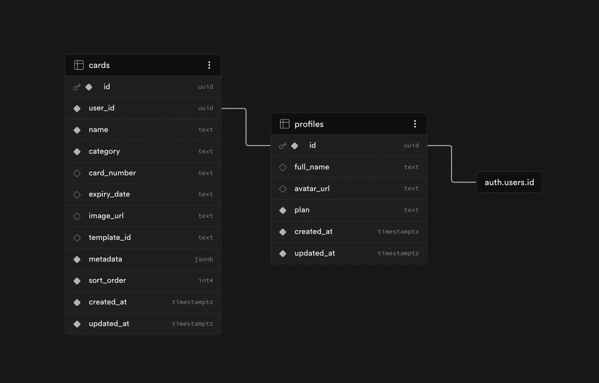

# OneWallet — הארנק הדיגיטלי החכם

> ארנק דיגיטלי בעברית שמרכז את כל הכרטיסים, התעודות והמסמכים שלך במקום אחד — עם סריקה חכמה באמצעות AI.

🔗 **פרויקט חי:** [one-wallet-six.vercel.app](https://one-wallet-six.vercel.app)

🏠 **דף נחיתה:** [one-wallet-six.vercel.app/landing](https://one-wallet-six.vercel.app/landing)

---

## הבעיה שאנחנו פותרים

הארנק הפיזי הישראלי הממוצע מכיל 8–12 כרטיסים: תעודת זהות, רישיון נהיגה, כרטיסי נאמנות, כרטיסי מתנה, תעודת סטודנט, ועוד. כשהארנק אובד — הנזק הוא כפול: גם אובדן הכרטיסים עצמם, וגם הטרחה של ביטול והנפקה מחדש.

בנוסף, כרטיסי מתנה ונאמנות עם יתרות נשכחים ופגים תוקף. אין מקום מרכזי אחד לנהל את כל המסמכים הללו בעברית, ב-RTL, עם ממשק ישראלי.

---

## קהל היעד

**ישראלים בגילאי 20–45** שנושאים ארנק עמוס ורוצים:
- גישה מהירה לתעודות ממכשיר הנייד
- להפסיק לחפש כרטיסי מתנה שנשכחו
- פתרון לאובדן ארנק (הצגת תעודות דיגיטליות לרשויות)

---

## מתחרים ובידול

| מתחרה | חסרון |
|--------|--------|
| Apple Wallet / Google Wallet | לא תומך בתעודות ישראליות, לא RTL, לא עברית |
| סריקת PDF ידנית | אין OCR, אין ארגון, אין UI |
| WhatsApp לעצמי | כאוטי, לא מאורגן, אין חיפוש |
| Stocard | לא תומך בתעודות ממשלתיות ישראליות |

**הבידול שלנו:**
- ✅ עברית מלאה + RTL
- ✅ סריקת OCR חכמה עם Claude AI — מזהה תעודות ישראליות אוטומטית
- ✅ תמיכה בתעודת זהות, רישיון נהיגה, נשק, סטודנט, מתנה ועוד
- ✅ ייצוא ל-Apple Wallet (.pkpass)
- ✅ מצב חירום "ארנק אבד" לדיווח מיידי

---

## פיצ'רים עיקריים

- **הוספת כרטיסים** — סריקת תמונה → Claude Haiku מזהה פרטים אוטומטית
- **10 קטגוריות** — תעודות, רישיונות, כרטיסי מתנה, נאמנות, סטודנט, ביקור ועוד
- **Apple Wallet** — ייצוא כרטיס כ-.pkpass לשימוש ב-Wallet
- **ארנק אבד** — מסך חירום עם הוראות דיווח וביטול
- **תוכנית Pro** — עד 10 כרטיסים (Free: 2 כרטיסים)
- **Google OAuth** — התחברות מהירה עם חשבון Google

---

## טכנולוגיות

| שכבה | טכנולוגיה |
|------|-----------|
| Frontend | React 18 + TypeScript + Vite |
| עיצוב | CSS Modules, RTL, Responsive |
| Backend | Supabase (PostgreSQL + Auth + Storage + Edge Functions) |
| AI | Anthropic Claude Haiku (OCR סריקת כרטיסים) |
| Deploy | Vercel (CI/CD אוטומטי) |
| בדיקות | Vitest — 11 טסטים |
| Monitoring | Vercel Analytics + Microsoft Clarity + Sentry |

---

## שירותים חיצוניים ואינטגרציות

| שירות | סוג | תפקיד במוצר |
|--------|-----|-------------|
| **Supabase Auth** | אוטנטיקציה | התחברות עם מייל/סיסמה |
| **Google OAuth** | אוטנטיקציה | התחברות מהירה עם Google |
| **Anthropic Claude Haiku** | API — בינה מלאכותית | OCR: סריקת תמונות כרטיסים וחילוץ פרטים אוטומטי |
| **Supabase PostgreSQL** | בסיס נתונים | אחסון פרופילים וכרטיסים |
| **Supabase Storage** | אחסון קבצים | תמונות כרטיסים |
| **Supabase Edge Functions** | לוגיקת שרת | הפעלת Claude API, Stripe, Apple Wallet ו-Resend מאחורי שרת (הסתרת מפתחות) |
| **Stripe** | תשלומים | עיבוד תשלום לשדרוג Pro (₪10/חודש) |
| **Resend** | מיילים | שליחת מייל ברוכים הבאים ואיפוס סיסמה |
| **Apple PassKit** | ייצוא | יצירת קבצי .pkpass ל-Apple Wallet |
| **Vercel** | דיפלוימנט | אחסון האפליקציה + CI/CD אוטומטי |
| **Vercel Analytics** | מדידה | ניתוח תנועה ועמודים |
| **Microsoft Clarity** | מדידה | הקלטת sessions ו-heatmaps |
| **Sentry** | ניטור שגיאות | מעקב אחר JavaScript errors בזמן אמת |

---

## מודל הנתונים (ERD)



**טבלאות עיקריות:**

```
profiles
├── id (uuid, FK → auth.users)
├── full_name (text)
├── avatar_url (text)
├── plan (text: 'free' | 'pro')
├── created_at (timestamptz)
└── updated_at (timestamptz)

cards
├── id (uuid, PK)
├── user_id (uuid, FK → profiles.id)
├── name (text)
├── category (text: id|license|loyalty|gift|student|visit|other|disability|medical)
├── card_number (text)
├── expiry_date (text)
├── image_url (text)
├── template_id (text)
├── metadata (jsonb)
├── sort_order (int)
├── created_at (timestamptz)
└── updated_at (timestamptz)
```

**RLS (Row Level Security):** כל משתמש רואה ועורך רק את הנתונים שלו.

---

## הרצה מקומית

```bash
# שיבוט הפרויקט
git clone https://github.com/MikelBeizermam/OneWallet.git
cd OneWallet

# התקנת dependencies
npm install

# הגדרת משתני סביבה
cp .env.example .env.local
# מלא VITE_SUPABASE_URL ו-VITE_SUPABASE_ANON_KEY

# הרצה מקומית
npm run dev

# הרצת בדיקות
npm test
```

---

## נתוני דמו לבדיקה

להתחברות מהירה ניתן להשתמש ב-Google OAuth, או ליצור חשבון חדש עם מייל.

לבדיקת פיצ'רי Admin (ניהול משתמשים, שדרוג Pro ידני): `miki199838@gmail.com`

---

## מבנה הפרויקט

```
src/
├── pages/          # עמודים (Home, Cards, Profile, Admin...)
├── components/     # רכיבים משותפים (BottomNav, WalletCard...)
├── contexts/       # AuthContext, CardsContext
├── hooks/          # useCards, useNotifications
├── lib/            # supabase client
├── data/           # נתוני בתי עסק (BuyMe, HTZ)
├── types/          # TypeScript types
└── tests/          # 11 בדיקות Vitest

supabase/
├── schema.sql      # סכמת בסיס הנתונים
├── seed.sql        # נתוני דמו
└── functions/      # Edge Functions (scan-card, generate-pass, send-email...)
```

---

*פותח במסגרת קורס פיתוח מוצר מבוסס AI — 2026*
